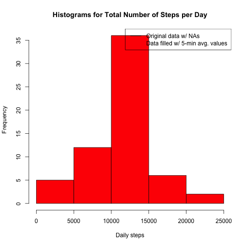
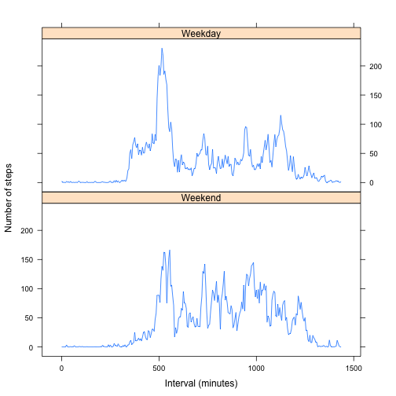

## Introduction
In this assignment, we read in data Xyz.

Install packages and load libraries:

```r
install.packages("lubridate",repos="http://cran.rstudio.com/")
```

```
## Error in install.packages : Updating loaded packages
```

```r
library(lubridate)
install.packages("plyr",repos="http://cran.rstudio.com/")
```

```
## Error in install.packages : Updating loaded packages
```

```r
library(plyr)
```

```
## Warning: package 'plyr' was built under R version 3.1.2
```

```
## 
## Attaching package: 'plyr'
## 
## The following object is masked from 'package:lubridate':
## 
##     here
```

## Loading and preprocessing the data
The activity data is read into a dataframe and we create a timestamp based on the date.

```r
activity<-read.csv('activity.csv')
timestamp<-as.POSIXlt(activity$date)
```
## What is mean total number of steps taken per day?
For this part of the assignment, the missing values in
the dataset are ignored.

1. A histogram of the total number of steps taken each day

```r
daytotal<-tapply(activity$steps,activity$date,sum) 
hist(daytotal,main="Histogram of Total Number of Steps per Day",xlab="Daily steps")
```

 

2. The **mean** and **median** total number of steps taken per day
The mean total number of steps per day:

```r
daytotal.mean<-mean(daytotal,na.rm=TRUE)
daytotal.mean
```

```
## [1] 10766.19
```
The median total number of steps per day:

```r
daytotal.median<-median(daytotal,na.rm=TRUE)
daytotal.median
```

```
## [1] 10765
```


## What is the average daily activity pattern?
1. A time series plot (i.e. `type = "l"`) of the 5-minute interval (x-axis) and the average number of steps taken, averaged across all days (y-axis)

```r
#Calculate the mean of the steps as a function of the time interval
interval.mean<-tapply(activity$steps,activity$interval,mean,na.rm=TRUE)
#Use lubridate to convert the five minute intervals into time of day and create
#new variable xt which is of type POSIXct (ranges from 00:00 to 23:55)
x<-ymd("09-01-01") #arbitrary date picked (since date isn't part of the plot)
m=minutes(seq(from=0,to=60*24-5,by=5))
xt<-ymd(x)+m
#Create the plot
plot(xt,interval.mean,
     type="l",
     xlab="5-minute intervals",
     ylab="Steps",
     main="Average daily activity pattern")
```

 

2. Which 5-minute interval, on average across all the days in the dataset, contains the maximum number of steps?

```r
interval.levels<-levels(as.factor(activity$interval))
steps.max<-max(interval.mean)
interval.max<-interval.levels[interval.mean==steps.max]
interval.max
```

```
## [1] "835"
```

## Imputing missing values
1. The total number of missing values in the dataset (i.e. the total number of rows with `NA`s)

```r
na.ct<-sum(is.na(activity$steps))
na.ct
```

```
## [1] 2304
```
2. Devise a strategy for filling in all of the missing values in the dataset. The strategy does not need to be sophisticated. For example, you could use the mean/median for that day, or the mean for that 5-minute interval, etc.
 
 
The imputation strategy applied in this assignment is using the mean for the 5-minute interval for the missing data. To do this, a table was first created with all of the 5-minute intervals and their corresponding average number of steps. The plyr library was used to join the original data with the table of interval averages. Then using the null values index the missing data was replaced with the corresponding interval average.

3. Create a new dataset that is equal to the original dataset but with the missing data filled in.

```r
#Create table of interval levels and the average number of steps
intervals.df=data.frame(interval=interval.levels,interval.mean=interval.mean)
activity$interval<-as.factor(activity$interval)#to match the class for the
#intervals data frame above

#Merge the original data with the table of interval averages
data.merge<-join(activity,intervals.df,by="interval", type="left")
activity.filled<-activity
#Find the missing values in the activity data frame and replace these with the 
#interval averages
missing<-which(is.na(activity$steps))
activity.filled[missing,"steps"]=data.merge[missing,"interval.mean"]
```

4. Make a histogram of the total number of steps taken each day and Calculate and report the **mean** and **median** total number of steps taken per day. Do these values differ from the estimates from the first part of the assignment? What is the impact of imputing missing data on the estimates of the total daily number of steps?

Histogram of filled data:

```r
daytotal.filled<-tapply(activity.filled$steps,activity.filled$date,sum) 
hist(daytotal.filled,main="Histogram of Daily Steps for Filled Data",xlab="Daily steps")
```

 

Mean of filled data for total number of steps taken per day:

```r
daytotal.filled.mean=mean(daytotal.filled,na.rm=TRUE)
daytotal.filled.mean
```

```
## [1] 10766.19
```

Median of filled data for total number of steps taken per day:

```r
daytotal.filled.median=median(daytotal.filled,na.rm=TRUE)
daytotal.filled.median
```

```
## [1] 10766.19
```
Do these values differ from the estimates from the first part of the assignment?
The difference in mean values:

```r
daytotal.filled.mean-daytotal.mean
```

```
## [1] 0
```
The difference in median values:

```r
daytotal.filled.median-daytotal.median
```

```
## [1] 1.188679
```

What is the impact of imputing missing data on the estimates of the total daily number of steps?
*E (will bump up min? ); overplot of two histograms

```r
summary(daytotal.filled)
```

```
##    Min. 1st Qu.  Median    Mean 3rd Qu.    Max. 
##      41    9819   10770   10770   12810   21190
```

```r
summary(daytotal)
```

```
##    Min. 1st Qu.  Median    Mean 3rd Qu.    Max.    NA's 
##      41    8841   10760   10770   13290   21190       8
```

```r
hist(daytotal,col="black")
```

 

```r
hist(daytotal.filled,main="Histograms for Total Number of Steps per Day",xlab="Daily steps",col="red")
legend_txt<-c("Original data w/ NAs","Data filled w/ 5-min avg. values")
legend("topright", lty= 1, col = c("black","red"), legend = legend_txt)
```

 

```r
range(daytotal)
```

```
## [1] NA NA
```

```r
range(daytotal.filled)
```

```
## [1]    41 21194
```

## Are there differences in activity patterns between weekdays and weekends?
For this part the `weekdays()` function may be of some help here. Use
the dataset with the filled-in missing values for this part.

1. Create a new factor variable in the dataset with two levels -- "weekday" and "weekend" indicating whether a given date is a weekday or weekend day.

```r
#Translate the day into the day of the week (e.g. Monday, etc.)
dayname<-weekdays(timestamp)
#Make a variable of the same length set to "weekday"and then replace this for 
#"weekend" for days that begin with S (Saturday, Sunday)
dayofweek<-rep("weekday",length(dayname))
dayofweek[grepl("^S",dayname)]<-"weekend"
```


2. Make a panel plot containing a time series plot (i.e. `type = "l"`) of the 5-minute interval (x-axis) and the average number of steps taken, averaged across all weekday days or weekend days (y-axis). 

```r
weekday.mean<-with(activity.filled[dayofweek=="weekday",],tapply(steps,interval,mean,na.rm=TRUE))
weekend.mean<-with(activity.filled[dayofweek=="weekend",],tapply(steps,interval,mean,na.rm=TRUE))

par(mfrow=c(2,1))
plot(xt,weekend.mean,main="Weekend",xlab="Interval",ylab="Number of Steps",type="l",
     ylim=c(0,250))
plot(xt,weekday.mean,main="Weekday",xlab="Interval",ylab="Number of Steps",type="l",
     ylim=c(0,250))
```

 
